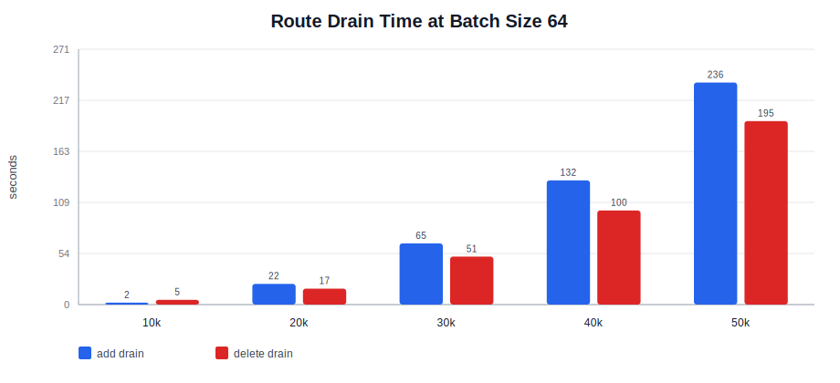
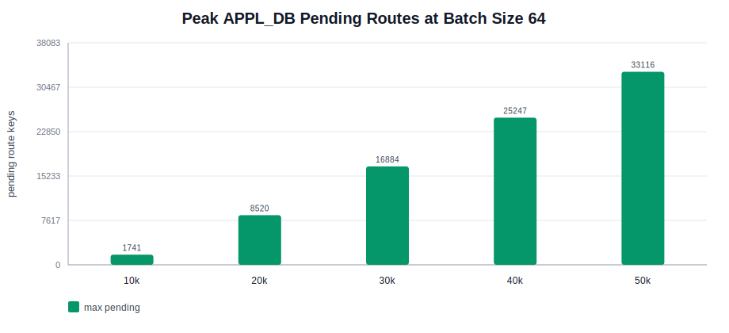

# sonic-swss-burst-perf

Benchmark toolkit and captured results for evaluating SONiC SWSS pipeline performance under burst route updates in a KVM SONiC virtual switch.

The workload emulates a BGP-like route burst by writing route add/delete events into APPL_DB `ROUTE_TABLE`, then measuring how Redis, SWSS/orchagent, and downstream virtual SAI/syncd behave while the queue drains.

## Repository Contents

- `tools/`: benchmark scripts for injection, metric collection, matrix runs, and reporting.
- `results/`: captured benchmark runs from the SONiC VM.
- `charts/`: generated CSV/SVG summaries of the captured results.
- `logs/`: VM serial log captured during the experiment.
- `run/`: local VM runtime notes and PID metadata. Runtime sockets are intentionally not committed.
- `images/`: ignored local VM image storage.

## Key Result

For the clean batch-size-64 runs, Redis/APPL_DB injection was fast, but route draining became the limiting factor at higher route counts. The strongest bottleneck signal is SWSS/orchagent per-event processing: pending route keys remained high after injection stopped, while syncd was not the dominant CPU consumer.

| Run | Add injection | Delete injection | Add drain | Delete drain | Peak pending |
| --- | ---: | ---: | ---: | ---: | ---: |
| 10k routes, batch 64 | 4.674s / 2139.6 rps | 2.890s / 3460.6 rps | 2s | 5s | 1741 |
| 50k routes, batch 64 | 23.420s / 2134.9 rps | 19.371s / 2581.1 rps | 236s | 195s | 33116 |

The knee appears between roughly 20k and 30k routes for batch size 64. In the knee run, add drain time increased from 22s at 20k routes to 65s at 30k and 132s at 40k.

## Visual Summary





The raw chart data is in `charts/benchmark_summary.csv`.

## How To Run Again

Inside the SONiC VM:

```bash
cd ~/swss-test
METRIC_DURATION=300 DRAIN_TIMEOUT=600 COUNT_SET="50000" BATCH_SET="64" ./run_burst_matrix.sh results/clean_50k_b64
python3 report_swss_burst.py results/clean_50k_b64
```

For a smaller sanity run:

```bash
METRIC_DURATION=180 DRAIN_TIMEOUT=300 COUNT_SET="10000" BATCH_SET="64" ./run_burst_matrix.sh results/clean_10k_b64
python3 report_swss_burst.py results/clean_10k_b64
```

## Interpretation

Redis was able to enqueue route updates at about 2.1k routes/s for add bursts with batch size 64. The much longer drain time at 50k routes means the hot path after enqueue is slower than the producer. Docker stats from the run showed high `swss` CPU, moderate/spiky database CPU, low `syncd` CPU, and mostly idle `bgp`, which points to orchagent route-event processing rather than virtual SAI saturation.

One caveat: the test routes used nexthop `10.0.0.1` on `Ethernet0` in a SONiC VS environment where interface/nexthop resolution can affect route handling. A follow-up test with explicitly resolved nexthop state would separate pure route programming cost from dependency/retry cost.

## Git Notes

Large VM images are ignored and should stay outside Git:

- `images/`
- `*.img`
- `*.qcow2`
- `*.iso`

Captured benchmark outputs are committed on purpose for analysis and comparison.
